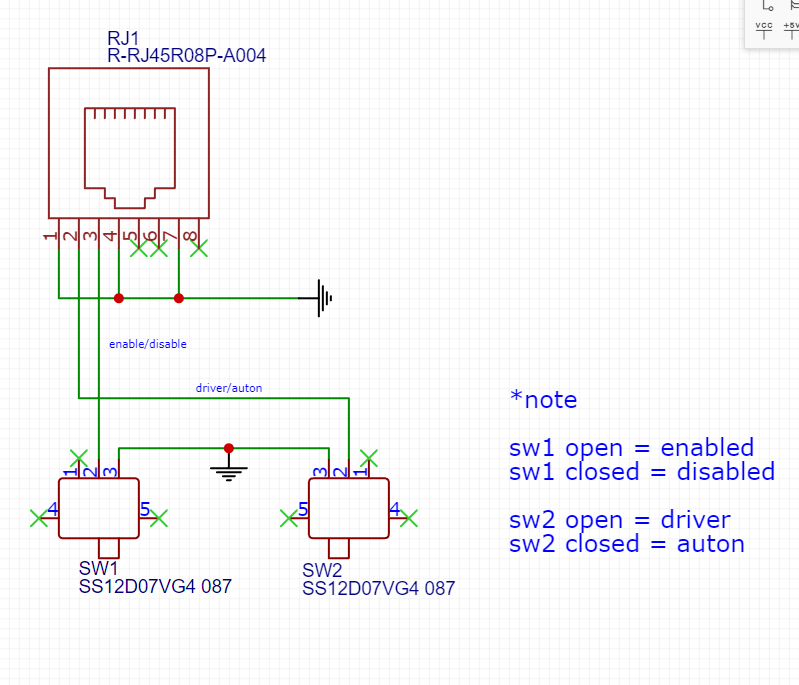
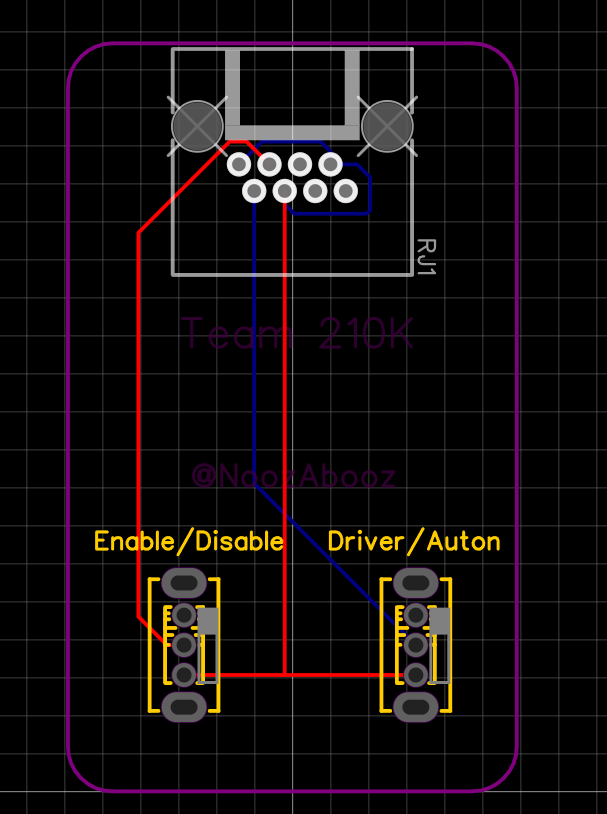
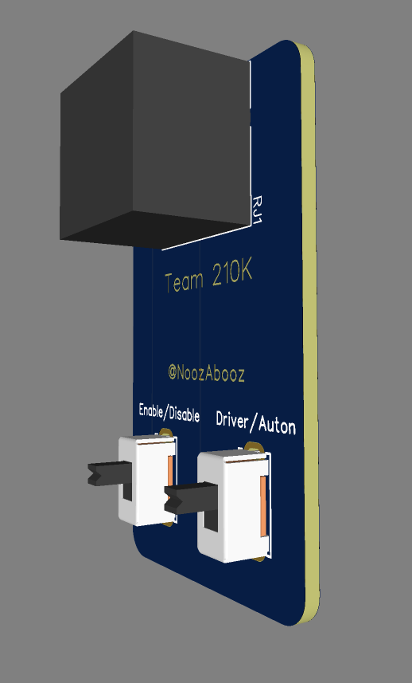
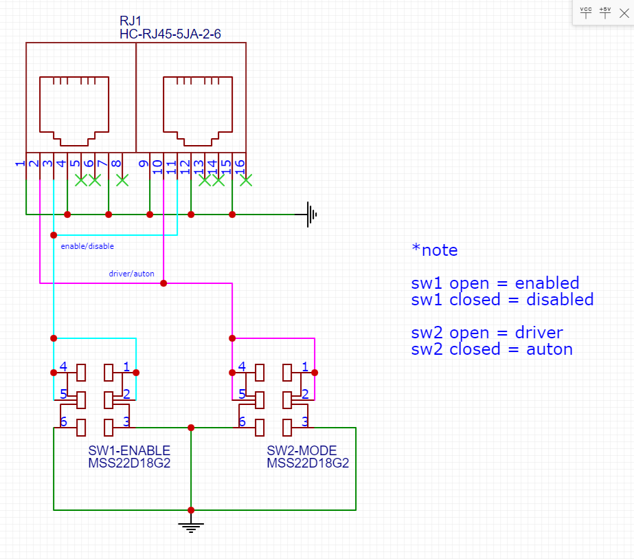
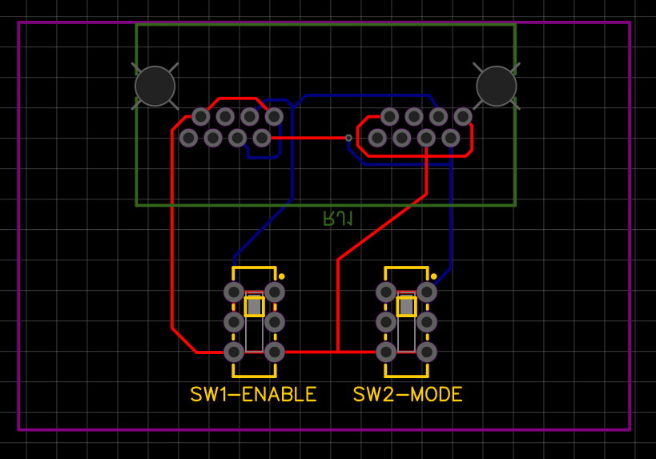
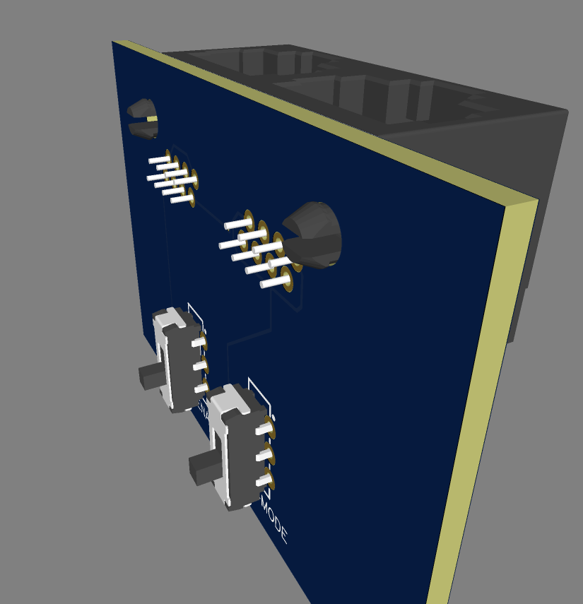
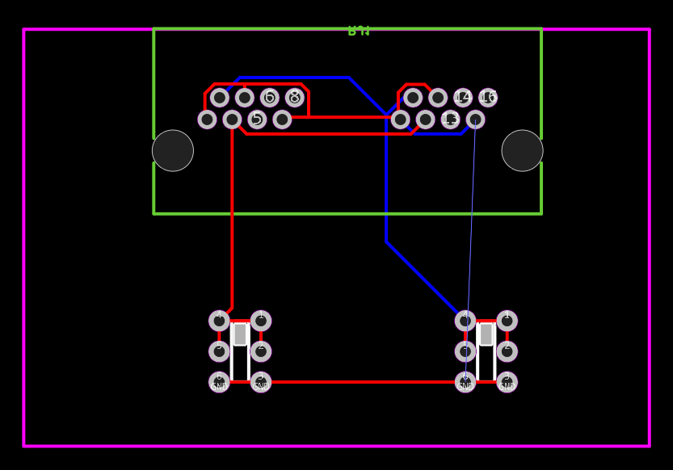
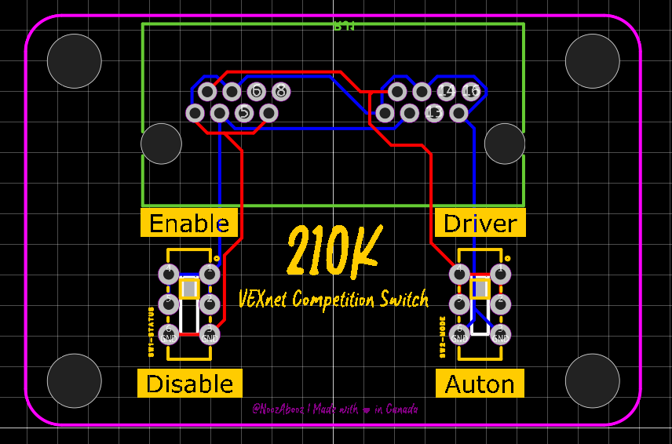
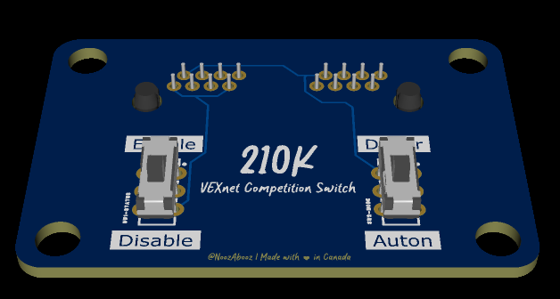
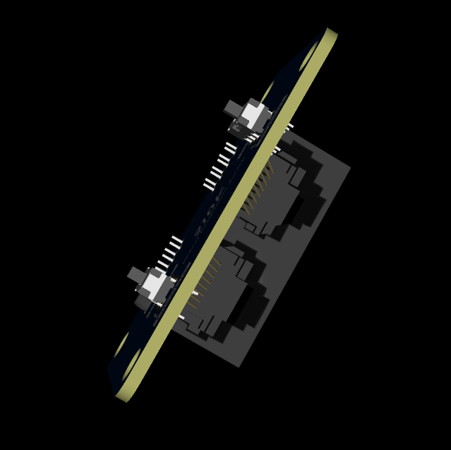

# June 22nd: Started & Finished Solo Port V1
Today, I laid out the schematic and designed the PCB for v1 of the comp switch. This is a prototype to ensure my wiring is laid out correctly and refine my wiring skills for more complex Duo port variant. Specifically, I need to ensure that the RJ45 connector is wired to the right pins, and the SPDT switch positions align with the protocols defined by VEX.

**Cumulative time spent: 2h**

# June 23rd: Start Duo Port V1 Layout 
This "duo port" variant supports simultaneously controlling 2 robots, each plugged into its own RJ45 port on the PCB. This meant configuring the the two ports to be wired in parallel each SPDT slide switch. Realizing the solo port variant's slide switches would likely fall off the PCB after lots of use, I switched to the MSS22D18G2 slide switches which are soldered with its 6 pins instead of 6. Hopefully this should make a stronger attachment to the PCB.

**Cumulative time spent: 3h**

# June 24th: Design Duo Port V1.0 PCB
I did a "first pass" attempt to wire V1.0 of the PCB. For simplicity, I placed the RJ45 ports facing the wrong direction to help figure out the correct pins to connect. I am not satisifed with having to use a via in this design though, so I will likely re-route the traces to avoid it in V2, along with positioning the RJ45 ports correctly.

**Cumulative time spent: 4h**

# June 25th: Design Duo Port V1.1 PCB
I fliped the RJ45 ports in this revision to face downwards as on the final product. I also re-routed the traces to avoid using a via, which should make the PCB less complex. HOWEVER, I realized that I used quite a few 90 degree angles in the traces, which is bad practice. I decided halfway through the design to restart.

**Cumulative time spent: 4.5h**

# June 30th: Design Duo Port V1.2 PCB
I restarted the PCB design from scratch, this time avoiding 90 degree angles in the traces. I also added labels to the silkscreen layer to indicate which switch controls which port. I am much happier with this design, and I will be ordering it soon.

**Cumulative time spent: 6h**